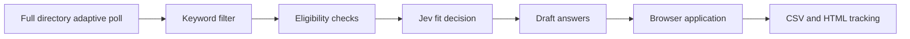

# Job application spec

Decided design for Greeshmanth’s job-application automation. This is the current spec. Building waits on the five open items at the end.

## What it does

The system polls the full Greenhouse, Ashby, and Lever directory on an adaptive schedule, drops obvious misses with a keyword filter, runs deterministic eligibility checks, and asks jev for a yes or no from `profile.md` and the job description. A no, or any uncertainty, stops the job. On a yes, a separate model drafts form answers from the profile. Our own browser fills the hosted apply page. Every stage is written to a log, and a static HTML page lists the applications.

There is no company allowlist. The profile and the eligibility rules are the allowlist. A curated company list would drop suitable roles at companies you have not named.

Perplexity Computer is the reference for this loop, from the use case on their site: scan roles, tailor the application, submit, and track the result. Computer is not a component. We do not call it.

## Poll

Greenhouse, Ashby, and Lever, across companies that post there. There is no platform-wide feed. Each public API is one company board per request, with no API key on the read.

A full pass of every board is about 13,000 calls: 6,889 Greenhouse, 3,910 Ashby, and 2,119 Lever. One call returns that company’s open jobs. It is not one call per job. At about one request per second that first walk takes about four hours. Later walks are shorter once empty boards and failing boards move to slower schedules.

Greenhouse and Ashby do not publish a read rate limit. Lever’s robots file asks for one second between requests. Add a small random delay on top of that spacing so requests are not fired on a perfect clock. Keep the average near one request per second, and never go under Lever’s one-second crawl delay.

### Schedule

Each board has its own next-check time. A new slug starts on the six-hour tier.

- **Engineer-hiring boards.** Poll every hour while the latest successful scan has an open title from the software-engineer include list and that posting is not a hard location miss. The same jobs on the next pass do not slow the board down. A later scan with no such title returns the board to six hours. A past fit score does not change the interval.
- **Other live boards.** Poll every six hours while they have open jobs and none of those titles match.
- **Empty boards.** A successful response with zero open jobs moves the board to once a day and clears the engineer-hiring flag. The next pass that finds jobs puts it back on six hours, or one hour if an engineer title is open.
- **Failing boards.** A 404, a timeout, or a hard error increments a consecutive-failure count. After three failures in a row, poll weekly. The engineer-hiring flag stays until a later success, which clears the count and returns the board to one hour, six hours, or daily from the jobs in that response. A board is never deleted because of a 404. A rename, an outage, or a temporary config change would otherwise drop that employer for good.
- **Newly discovered boards.** A careers URL seen later, or a slug from a newer public directory, is added and polled on the six-hour tier.

Only new job ids continue past the poll. A job already in the log is not sent through the keyword filter or jev again.

### Greenhouse

- List: `GET https://boards-api.greenhouse.io/v1/boards/{board_token}/jobs`
- Description: add `?content=true` on the list, or `GET .../jobs/{job_id}`
- Form: `GET .../jobs/{job_id}?questions=true`
- Hosted page: `absolute_url`
- Job id for dedup: the job-post `id`

The listing call can stay light (title, location, id). The description and the form are extra calls, and only for jobs that pass the keyword filter.

### Ashby

- List and description: `GET https://api.ashbyhq.com/posting-api/job-board/{name}`
- Hosted page: `applyUrl` on that response
- The public response has no posting id. Dedup on `jobUrl` until a stabler id shows up.
- Skip `isListed: false`
- The public API does not return the form

### Lever

- List and description: `GET https://api.lever.co/v0/postings/{site}?mode=json`
- EU boards: `api.eu.lever.co`
- Hosted page: `applyUrl`
- Job id for dedup: the posting `id`
- A large site needs extra pages (`skip` and `limit`)
- Custom questions are not in this API

## Board directory

The poll walks [ats-board-directory.csv](../data/ats-board-directory.csv). The readout is [ats-board-directory.md](ats-board-directory.md).

12,918 boards. The file is the union of two public sources. When both list the same board, the September row is kept. The older file fills what September never saw.

| Vendor | Boards | September only | July–August only | Both |
| --- | ---: | ---: | ---: | ---: |
| Greenhouse | 6,889 | 1,923 | 2,174 | 2,792 |
| Ashby | 3,910 | 1,054 | 1,069 | 1,787 |
| Lever | 2,119 | 6 | 2,091 | 22 |
| Total | 12,918 | 2,983 | 5,334 | 4,601 |

- September rows come from Common Crawl `CC-MAIN-2026-39`, pages fetched 4–17 Sep 2026. None of the three hosts publish a company sitemap.
- July–August rows come from the LastRound AI directory (`lastroundai-ats-company-directory-2026-08`, CC-BY-4.0). Ashby in that file was crawled about 12–17 Jul 2026. Greenhouse and Lever ran through 1 Aug 2026.
- Lever in the September crawl was 28 boards, because the crawler stored almost every Lever URL as a 403. The merge puts Lever back to 2,119. Those added rows still carry the July–August date and were not rechecked.
- A sample of 65 September slugs returned 53 live and 12 gone. The rest of the file is unchecked.
- A company in neither source is missing. So is a board created after 17 Sep 2026 that was not already in the July–August file, and a careers site on the company’s own domain that never exposes `greenhouse.io`, `ashbyhq.com`, or `lever.co`.
- A careers URL seen later (`boards.greenhouse.io/{slug}`, `jobs.ashbyhq.com/{slug}`, `jobs.lever.co/{slug}`) is added. A newer public directory is merged the same way: same vendor and slug, newer row wins.

Columns: `ats_vendor`, `company_name`, `board_slug`, `source`, `source_date`, `confirmed`, `http_status`. Most company names are blank unless LastRound or a Greenhouse confirmation supplied one.

## Keyword filter

This runs before jev. It cuts volume. It is not the fit decision.

- Title include and exclude, plus a short must-have or excluded term list
- Location, remote, or hybrid when the posting states it
- Already in the log under the same external id
- Ashby rows with `isListed: false`

A miss is logged as `keyword_reject` and stops. The terms themselves are an open item below.

## Eligibility

Code checks the rules that are facts, after the keyword filter and before jev. jev is unreliable at counting, dates, and arithmetic, so those checks do not go to the model.

- Years of experience, when both the posting and the profile state a number
- A stated deal-breaker the posting names in plain terms: sponsorship, clearance, citizenship, or a city you will not move to
- Work authorization when the posting states a requirement and the profile states your status

A miss is logged as `eligibility_reject` and stops. Anything that is a judgment about fit, rather than a number or a stated deal-breaker, waits for jev. The exact rules come from the profile and the keyword list, which are still open.

## Decision with jev

jev is TypeSafe AI’s System One model. It returns a probability, not a written reason. Our code writes the one-line reason from which checks passed.

- Call: `POST https://api.typesafe.ai/v1/systemone` with `Authorization: Bearer` and `Content-Type: application/json`
- Model: start on `jev-1.13.0`. `jev-latest` is only while cutoffs are still moving.
- Inputs: `profile.md` and the job (title, location, body) as named fields on `state`. Trim the posting to the role, the requirements, and the location.
- One Noul question per literal check, all in one call. A check is a clear yes at or above 0.8 and a clear no at or below 0.2. The band between is `uncertain`. Those cutoffs are the TypeSafe example. Move them after real rows.
- The job is `yes` only when every required check is a clear yes and no deal-breaker has fired. Eligibility already removed the numeric and stated-deal-breaker cases.
- Uncertainty or any failed call does not apply. That includes a missing profile, an empty description, a token-limit error, `401`, `422`, `429`, `529`, and a timeout. Retry `429` and `529` with backoff a few times. A retry must not create a second application.
- Price: input is $0.042 per million tokens. Output is free. A call is about 3,000 to 10,000 tokens, roughly $0.13 to $0.42 per 1,000 jobs that reach jev. The keyword filter and the dedup keep most listings off this call.
- `profile.md` lives at the project root. jev reads the markdown. The PDF resume sits next to it for the upload.

The API key, the exact checklist, and the final cutoffs are open items below.

## Answers

A different model from jev. It does not get a vote on fit.

- Inputs: `profile.md`, the job description, and the form
- Output: one answer per field, copied or phrased from the profile
- A required field the profile does not answer stops the job. Record `blocked`. Leave visa, years, salary, and degrees blank unless the profile states them.
- Greenhouse questions come from `?questions=true` before the browser opens
- Ashby and Lever questions are read from the hosted page

The model is `gpt-6-luna`. It is OpenAI’s efficient model for focused, high-volume work. Short-context price is $0.10 per million input tokens and $0.50 per million output tokens, so a draft is a fraction of a cent. `gpt-6-sol` stays available by changing `ANSWER_MODEL` if the drafts come out too thin. Sol is priced for heavier agent work, about twenty times Luna on input.

## Submit

The three submit APIs exist, and each one authenticates as the employer. A candidate does not get that key.

- Greenhouse: `POST https://boards-api.greenhouse.io/v1/boards/{board_token}/jobs/{id}` with the company’s Job Board API key. Rate limit not published.
- Lever: `POST https://api.lever.co/v0/postings/{site}/{id}?key=APIKEY`. The key is a Super Admin key for that account. More than 2 of these POSTs per second returns 429.
- Ashby: `POST https://api.ashbyhq.com/applicationForm.submit` with a key that has `candidatesWrite`. The public job API only returns `applyUrl`.

We submit on the hosted page with our own browser. Playwright types the drafted answers, attaches the resume file, and submits. The answer model does not click around. Greenhouse is a known form. Ashby and Lever require reading the page to see the fields, then the same fill.

A captcha or bot check stops that application for you to handle. The row records the stop.

The first runs stop after the draft. You read them on the HTML page. The browser submits only after a batch looks right. After that, unattended submit is on for later jev yeses, up to a daily cap. The cap is an open item below.

## Record

`data/applications.csv` is the log. Append a row as a job changes stage. Dedup on the external id before any draft is submitted.

| Column | What it holds |
| --- | --- |
| timestamp | UTC time of this stage |
| portal | `greenhouse`, `ashby`, or `lever` |
| external_job_id | Greenhouse job-post id, Lever posting id, or Ashby `jobUrl` |
| job | Title |
| company | Employer or board name |
| link | Hosted posting or apply URL |
| stage | `polled`, `keyword_reject`, `eligibility_reject`, `jev_no`, `jev_yes`, `drafted`, `submitted`, `failed`, `blocked` |
| reason | Keyword rule, checklist line, missing field, or error |
| model | jev model id when a jev call was made |

`uncertain` is stored as `jev_no` with the reason stating uncertainty. `submitted` is written only after the hosted page confirms the submit.

`data/applications.html` is the page you open. Each run regenerates it from the CSV. One row per application, so two roles at one company stay two rows. Columns on the page: company, role, portal, date, link, and status. The default view is submitted applications. Drafted, blocked, and failed rows are on the same page behind a filter. Keyword rejects, eligibility rejects, and jev nos stay in the CSV and off the default view.

## Cost

Polling the three public read APIs is free. A machine you already have can run the loop. A small hosted box is about $5 a month.

jev is the figure above, under about half a dollar per thousand jobs that reach it. The answer model is a small charge on the yeses. The browser step has no per-application fee. There is no Perplexity subscription in this design.

## Open

These five are still needed before a useful build. The first build can stop at drafts and the HTML page. The browser clicks submit only after you approve a batch.

1. **profile.md**, and the resume file the form will upload. You are writing these. jev and the answer model both read the markdown. The PDF is what gets attached.
2. **The keyword list and eligibility rules.** You are writing these. Titles to include and exclude, location or remote, level, and hard exclusions such as sponsorship, clearance, years, or cities you will not move to. Keywords cut volume. Eligibility is the deterministic pass. What is left is the jev checklist.
3. **A TypeSafe API key.** Paste it into `.env` at the repo root as `TYPESAFE_API_KEY`. That file is gitignored. `.env.example` shows the shape without a secret.
4. **Answer model: `gpt-6-luna`.** Set in `.env` as `ANSWER_MODEL`. Switch that value to `gpt-6-sol` if you want the heavier model. `OPENAI_API_KEY` is the other blank in the same file.
5. **A daily cap** for unattended submit, once that switch is on. The first runs are drafts either way, so this does not block the first build.
